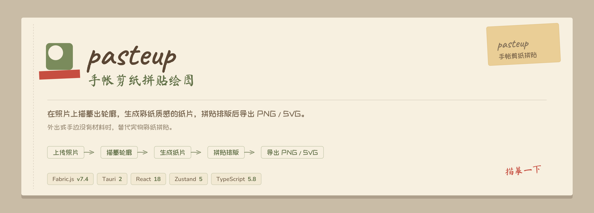

<p align="center">
  
</p>

<p align="center">
  
  
  
  
  
  
</p>

# pasteup

> 手帐剪纸拼贴绘图 app：在照片上描摹闭合出"纸片"，叠上程序生成的彩纸质感，拼贴排版后导出 PNG / SVG。外出或手边没有材料时，替代实物彩纸拼贴。

## 工作流

```
上传照片 → 在照片上描摹 → 生成彩纸质感纸片元素 → 拼贴排版 → 导出 PNG / SVG
```

- **描摹** — 在底图照片上自由描绘，闭合后自动生成一个"纸片"元素（`fabric.Path`）。
- **彩纸质感** — 每张纸由 seed 驱动生成程序化纹理（灰度明度层 × 用户选色），结构互不一致，保留手工随机感。MVP 内置 6 种风格：褶皱 / 水彩晕染 / 颗粒 / 织物拉丝 / 大理石纹 / 纤维。
- **拼贴** — 纸片可变换、排序、随选色即时刷新质感，撤销/重做全程可用。
- **导出** — PNG 成品图 + SVG 结构文件（纹理嵌入），导出离线重建画面，不打扰正在编辑的画布。

## 快速开始

前置要求：Node.js + pnpm + Rust（仅打包/桌面运行需要）。

```bash
# 安装依赖
pnpm install

# 启动前端开发服务（浏览器模式）
pnpm dev

# 运行测试与类型检查
pnpm test
pnpm test:types

# 生产构建
pnpm build
```

Tauri 桌面壳与双端发布链路见仓库 GitHub Actions workflow。

## 脚本

| 命令 | 说明 |
| --- | --- |
| `pnpm dev` | 启动 Vite 开发服务器 |
| `pnpm build` | 类型检查 + 生产构建 |
| `pnpm preview` | 预览生产构建 |
| `pnpm test` | 运行 vitest 测试（含 headless 渲染/导出用例） |
| `pnpm test:watch` | vitest watch 模式 |
| `pnpm test:types` | `tsc --noEmit` 类型检查 |

## 技术栈

| 层 | 选型 |
| --- | --- |
| 语言 | TypeScript |
| 前端 | React 18 · Vite 6 · Zustand 5 |
| 画布 | Fabric.js v7（唯一原生支持 SVG 含 pattern 导出的引擎，选型调研见下方文档） |
| 桌面壳 | Tauri 2（Rust，双平台打包 + GitHub Actions 发布） |
| 测试 | Vitest · jsdom · Testing Library |

## 架构约定

- **画布/UI 分工** — Fabric 管画布内部状态，React 只管 UI 外壳，经 `FabricCanvas` 桥接壳单向通信，不双向绑定。
- **纹理自包含** — 纹理资产统一转 dataURL，保证项目 JSON 与导出 SVG 自包含，不依赖外部 URL。
- **自定义序列化** — 走自定义 schema（`src/types/project.ts`），不依赖 Fabric `toObject` 默认行为。
- **深模块化** — 关键知识收拢为带窄 interface 的模块：`paperBridge`（schema↔fabric 映射）、`projectRenderer`（渲染同步）、`textureSupply`（纹理两层缓存）、`history`（撤销双栈）、`projectPersistence`（保存链路）。术语与决议见 `CONTEXT.md` 与 `docs/adr/`。

## 目录结构

```
src/
├── types/        # 项目 schema、画布尺寸
├── io/           # 项目文件读写、自动保存、持久化编排
├── fabric/       # fabric 桥接、渲染、描摹工具、命中测试
├── texture/      # 程序化纹理生成、着色合成、供给缓存
├── export/       # 离线导出（PNG / SVG）
├── picker/       # 系统取色（macOS / Windows）
├── styles/       # 手帐拟物样式 tokens、布局、动效
└── utils/        # 颜色、通用工具
src-tauri/        # Tauri 2 桌面壳（Rust）
prototypes/       # 纹理/渲染/UI 方向的原型实验
tools/            # README 品牌卡片生成脚本（同源字体 + 调色板）
docs/
├── assets/       # banner / 社交预览卡（`tools/make-readme-assets.py` 生成）
├── implementation-plan.md
├── research/     # 渲染引擎选型
└── adr/          # 架构决策记录
```

> [!NOTE]
> 编辑项目推荐以 `pnpm test` + `pnpm test:types` 为验收基准；触及渲染/导出的改动需在真实桌面环境手测核对。

## 文档

- 完整产品与实现方案：[`docs/implementation-plan.md`](docs/implementation-plan.md)
- 渲染引擎选型调研：[`docs/research/render-engine-selection.md`](docs/research/render-engine-selection.md)
- 领域上下文与术语：[`CONTEXT.md`](CONTEXT.md)
- 架构决策记录：[`docs/adr/`](docs/adr/)
- 质感实现原型：[`prototypes/texture-compare/`](prototypes/texture-compare/)
